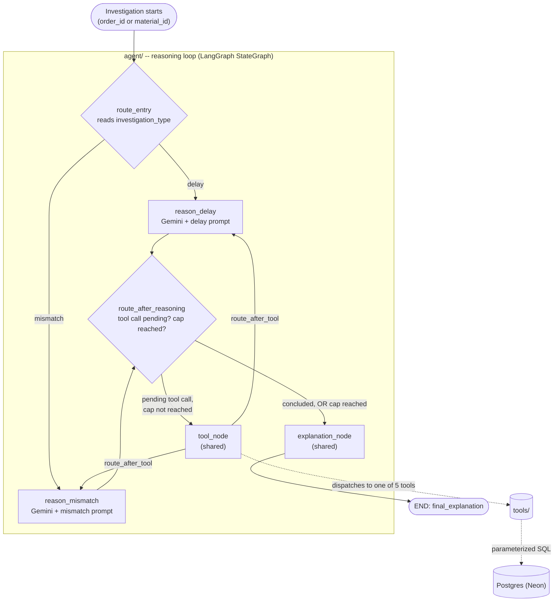

# Textile Mill Reconciliation Agent

An autonomous AI agent that investigates **order delays** and **inventory mismatches** in a
textile mill's production data. It works by reasoning over a small set of database tools in a
loop, not by running a fixed script. An LLM (Gemini) decides what to look up next based on what
it has already found, and stops once it has enough evidence to explain the problem in plain
language.

> Built as a portfolio project to demonstrate agentic AI: LLM-driven tool selection, looped
> reasoning with a hard safety cap, graceful failure handling, and a tested LangGraph state
> machine.


-336791)

---

## Table of contents

1. [Problem statement](#problem-statement)
2. [Why this is agentic, not a fixed pipeline](#why-this-is-agentic-not-a-fixed-pipeline)
3. [Key features](#key-features)
4. [Architecture](#architecture)
5. [The agent's tools](#the-agents-tools)
6. [Data model](#data-model)
7. [Tech stack](#tech-stack)
8. [Getting started](#getting-started)
9. [Configuration](#configuration)
10. [Usage](#usage)
11. [Example output](#example-output)
12. [Testing](#testing)
13. [Design decisions](#design-decisions)
14. [Project structure](#project-structure)
15. [Sample data vs. real deployment](#sample-data-vs-real-deployment)
16. [Roadmap](#roadmap)

---

## Problem statement

Picture a mid-sized textile mill in Pakistan. A few hundred orders are in flight at any time,
moving through **spinning → weaving → dyeing → finishing → QC → packed → shipped**. They're
tracked alongside a raw-material inventory that gets drawn down as orders progress.

Operations like this often rely on a small back-office team, maybe six to ten people, who
cross-check order status against inventory counts and production logs by hand:

- *"Is this order actually stuck, or did someone forget to log a stage transition?"*
- *"Does this material's recorded stock make sense given what's been consumed?"*

That reconciliation work doesn't scale with headcount as order volume grows. It's also the
kind of multi-step, evidence-gathering investigation that suits an LLM agent better than a
fixed report or dashboard.

**This project automates that investigation.** Point it at an order or a material. It gathers
its own evidence (order status, stage-duration baselines, inventory, historical delays, recent
material movement) and writes a plain-language diagnosis with a recommended action, the way a
back-office analyst would after pulling the same records.

## Why this is agentic, not a fixed pipeline

A fixed pipeline would *always* run the same queries in the same order, then fill in a report
template. That's not what happens here. An LLM sits in a loop and decides, one step at a time,
which tool to call next (if any), based on what it has learned so far. It also decides when it
has gathered enough evidence to stop.

The same agent takes very different paths depending on the data. Both of these are real
captured runs (see [Example output](#example-output)):

| Investigating delayed order #6 | Investigating mismatched material MAT-016 |
|---|---|
| 1. Look up the order's status | 1. Look up the material's inventory |
| 2. Get the `dyeing` stage baseline (is 22 days abnormal?) | 2. Check recent movement of that material |
| 3. Look up inventory for the order's material | 3. Trace order #18 drawing on it |
| 4. Check recent movement of that material | 4. Trace order #21 drawing on it |
| 5. Search for similar past delays in `dyeing` | 5. Sweep all inventory to see if other materials show the same pattern |

Each call was chosen because the previous result suggested it was worth checking. No script
says "always run these five."

## Key features

- **Two investigation paths.** *Delay* ("why is this order stuck?") and *mismatch* ("why
  doesn't this material's stock add up?"). They share one reasoning loop and differ only in
  their system prompt.
- **LLM-driven tool selection.** Gemini picks from 5 narrowly scoped, validated database tools,
  and can request several in one turn.
- **Hard safety cap.** The graph's routing logic enforces the tool-call limit (default 6 for
  delay, 7 for mismatch). It isn't a polite request the LLM could ignore.
- **Automatic model fallback.** If `gemini-3.5-flash` fails (rate limit, quota, outage), the
  agent retries with `gemini-3.6-flash` and then `gemini-3.5-flash-lite`. It uses
  `max_retries=1` per model, so failover takes seconds rather than about 90 seconds of internal
  retries.
- **Graceful degradation.** Tool errors come back to the LLM as observations it can adapt to,
  so they don't crash the run. If the cap is hit, the agent still turns the evidence it has into
  a report. If every model is down, the report says so honestly and lists the partial findings.
- **Full reasoning trace.** Every tool call, its arguments, its result, and which model answered
  are printed and written to `logs/agent.log`.
- **Security-minded tool layer.** Queries are parameterized SQL only. Inputs are validated,
  result sizes are capped, and driver errors are never passed to the LLM.
- **Tested.** 30 tests cover every tool, the router, the iteration cap, failure handling, and
  end-to-end runs against an isolated Postgres schema.

## Architecture



The code is split into two layers, and they don't overlap:

| Layer | Responsibility | Never does |
|---|---|---|
| `agent/` (**reasoning**) | Calls the LLM, decides *when* to use tools, interprets results, writes the report | Run SQL directly |
| `tools/` (**execution**) | Runs one validated, parameterized query and returns capped results | Decide when it should be called |

How the pieces fit together:

1. **Router (conditional entry point).** `route_entry` reads `investigation_type`, which is set
   when the initial state is built, not by the LLM. It starts the run at `reason_delay` or
   `reason_mismatch`.
2. **Reasoning node.** Calls Gemini with the full message history and the tool schemas. If the
   model asks for tools, the calls are placed in `pending_tool_calls`.
3. **`route_after_reasoning` (conditional edge).** Sends the run to `tool` if calls are pending
   and the cap hasn't been reached. Otherwise it goes to `explain`.
4. **`tool_node`.** Runs every pending call and turns failures into error `ToolMessage`s. It
   then loops back through `route_after_tool` to the reasoning node the run started at.
5. **`explanation_node`.** If the model concluded on its own, its last message *is* the report
   and no extra LLM call is made. If the cap cut the run short, it writes a report from the
   evidence gathered. If the LLM was unavailable, it returns an honest "could not complete"
   report with the partial findings.

State lives in a `TypedDict` (`agent/state.py`). The accumulating fields (`messages`,
`tool_call_history`, `findings`) use `Annotated[list, operator.add]` **reducers**, so each loop
pass appends to them instead of overwriting them. Runtime dependencies (the DB connection and
the LLM client) travel via `config["configurable"]` rather than state, which is also how tests
inject fakes.

See [`docs/architecture.md`](docs/architecture.md) for the detailed diagram walkthrough.

## The agent's tools

Each tool lives in its own file under `tools/`. Each is a single parameterized query that
validates its inputs, caps its output, and raises the shared `ToolQueryError` on failure.

| Tool | Purpose | Key inputs |
|---|---|---|
| `query_order_status` | An order's current stage, dates, and full stage history | `order_id` |
| `get_average_stage_duration` | Baseline average days spent in a stage (completed rows only) | `stage` |
| `find_similar_past_delays` | Past orders that spent at least N days in a stage ("has this happened before?") | `stage`, `min_days` |
| `query_inventory` | Inventory batches, optionally filtered by material | `material_id` / `material_name` |
| `check_recent_inventory_movements` | Production activity on orders using a material in the last N days (a proxy for stock drawdown) | `material_id`, `days` |

Valid stages are `spinning`, `weaving`, `dyeing`, `finishing`, `QC`, `packed`, and `shipped`.

## Data model

Four tables are defined in [`schema.sql`](schema.sql):

| Table | What it holds |
|---|---|
| `orders` | One row per customer order: buyer, material, quantity, `current_stage`, `stage_entered_date`, `expected_delivery_date` |
| `inventory` | On-hand stock per material batch: `material_id`, name, batch, `quantity_available`, location |
| `production_logs` | Append-only activity log per order and stage, with free-text notes (machine runs, QC checks) |
| `stage_history` | One row per stage an order passed through, with `entered_at` and `exited_at` (`NULL` while the order is still in that stage) |

## Tech stack

| Component | Choice |
|---|---|
| Language | Python 3.13 |
| Agent framework | LangGraph 1.1 (`StateGraph`, conditional edges, reducers) |
| LLM | Gemini 3.5 Flash via `langchain-google-genai`, with fallback to `gemini-3.6-flash` and then `gemini-3.5-flash-lite` |
| Database | Postgres 18 on [Neon](https://neon.tech) (serverless), via `psycopg2` |
| Sample data | `Faker` (seeded, reproducible) |
| Testing | pytest, run against an isolated `test_textile` schema |

## Getting started

### Prerequisites

- Python 3.13
- A Postgres database. A free [Neon](https://neon.tech) project works.
- A Google AI Studio API key from <https://aistudio.google.com/apikey>. You only need it to run
  the agent live. The tool tests don't need it.

### Installation

```bash
# 1. Create a virtual environment and install dependencies
python -m venv .venv
source .venv/bin/activate          # Windows: .venv\Scripts\activate
pip install -r requirements.txt

# 2. Configure environment
cp .env.example .env               # then fill in DATABASE_URL and GOOGLE_API_KEY

# 3. Create the schema and seed sample data
python setup_db.py                 # applies schema.sql
python db/generate_sample_data.py  # 40 orders, ~19 inventory batches, 5 deliberate anomalies
                                   # (idempotent: truncates first)

# 4. Sanity-check the seeded data
python scripts/verify_data.py
```

## Configuration

All configuration is read in exactly one place, [`config/settings.py`](config/settings.py). No
other module reads environment variables.

| Variable | Required | Default | Description |
|---|---|---|---|
| `DATABASE_URL` | yes | none | Postgres connection string (keep `sslmode=require` for Neon) |
| `GOOGLE_API_KEY` | for live runs | none | Gemini API key. Live tests skip themselves if it's unset |
| `GOOGLE_MODEL` | no | `gemini-3.5-flash` | Primary reasoning model |
| `GOOGLE_FALLBACK_MODELS` | no | `gemini-3.6-flash,gemini-3.5-flash-lite` | Comma-separated backups, tried in order |
| `MAX_TOOL_CALLS_DELAY` | no | `6` | Tool-call cap for delay investigations |
| `MAX_TOOL_CALLS_MISMATCH` | no | `7` | Tool-call cap for mismatch investigations. It's one higher because this path often wants a broad inventory sweep to verify its finding |

## Usage

### Command line

```bash
python scripts/run_agent_demo.py delay              # auto-picks the most stuck order
python scripts/run_agent_demo.py mismatch           # auto-picks the most anomalous material
python scripts/run_agent_demo.py delay 6            # investigate a specific order
python scripts/run_agent_demo.py mismatch MAT-016   # investigate a specific material
```

Each run prints the reasoning trace, whether the agent concluded on its own or hit the cap, and
the final explanation. The same trace is written to `logs/agent.log`.

### From Python

```python
from agent.graph import run_investigation, run_mismatch_investigation

result = run_investigation(order_id=6)
print(result["final_explanation"])
print(result["tool_call_history"])   # the full reasoning trace

result = run_mismatch_investigation(material_id="MAT-016", max_tool_calls=5)
```

Both functions return the final `AgentState`. They accept optional `conn` (a DB connection to
reuse) and `llm` (a model override for testing).

## Example output

Both examples are real runs captured against the seeded sample data, not invented output.

### Delay investigation (order #6)

```
Investigating order_id=6 (delay)...

=== Reasoning trace ===
  step 1: query_order_status({'order_id': 6}) -> [ok] {"order_id": 6, "current_stage": "dyeing",
          "stage_entered_date": "2026-08-02", "expected_delivery_date": "2026-08-08", ...}
  step 2: get_average_stage_duration({'stage': 'dyeing'}) -> [ok] {"stage": "dyeing", "avg_days": "3.23", "sample_size": 20}
  step 2: query_inventory({'material_name': 'cotton-polyester twill'}) -> [ok] [{"material_id": "MAT-012", ...}]
  step 3: check_recent_inventory_movements({'days': 30, 'material_id': 'MAT-012'}) -> [ok] [...]
  step 3: find_similar_past_delays({'stage': 'dyeing', 'min_days': 3}) -> [ok] [...]

concluded_naturally=True  tool_calls_used=5

=== Final explanation ===
### Diagnosis: Data Inconsistency (Unrecorded Stage Transition)

Order #6 appears severely delayed in the tracking system — showing over 20 days in the
`dyeing` stage against a plant average of 3.23 days, and missing its August 8 expected
delivery date. However, production activity logs reveal that the physical dyeing process
was completed long ago.

**Supporting evidence:**
1. Stage baseline: average duration for `dyeing` across completed orders is 3.23 days.
2. Production log on August 2 (6 hours after entering the stage): "Dye lot matched to
   standard, shade approved."
3. Despite that shade-approval log, no exit timestamp was ever recorded in stage history,
   leaving the order stuck in `dyeing` status.

**Recommended action:** Manually close out the `dyeing` stage as of August 2 and verify the
order's actual physical location on the floor.
```

### Inventory-mismatch investigation (MAT-016)

```
Investigating material_id=MAT-016 (inventory mismatch)...

=== Reasoning trace ===
  step 1: query_inventory({'material_id': 'MAT-016'}) -> [ok] [{"material_id": "MAT-016",
          "material_name": "viscose rayon yarn", "quantity_available": "9999.0", "location": "Warehouse B"}]
  step 1: check_recent_inventory_movements({'days': 30, 'material_id': 'MAT-016'}) -> [ok] [...]
  step 2: query_order_status({'order_id': 18}) -> [ok] {...}
  step 2: query_order_status({'order_id': 21}) -> [ok] {...}
  step 3: query_inventory({}) -> [ok] [...]  (checking whether other materials show the same pattern)

concluded_naturally=True  tool_calls_used=5

=== Final explanation ===
### Inventory Investigation Report: MAT-016 (Viscose Rayon Yarn)

**Summary:** The inventory system records a static balance of 9,999.0 units in Warehouse B
(Batch BATCH-GG763), which does not reflect heavy recent production consumption and order
fulfillments.

**Key evidence:**
1. Recorded level is exactly 9,999.0 units — unlike every other tracked material, which
   shows precise physical counts (e.g. 1,446.9, 12.0), MAT-016 looks like a hardcoded
   placeholder/default value rather than a real count.
2. Over the past 30 days: orders #18, #32, #36 shipped a combined 7,274 units of this
   material; multiple other in-progress orders account for 11,000+ additional units moving
   through production.

**Root cause:** Automated inventory deductions are failing to trigger/update for MAT-016 as
material is issued and orders ship.

**Recommended action:** Physically audit batch BATCH-GG763, and inspect the deduction
workflow to ensure it resumes on stage updates and dispatch.
```

Notice that in the delay run the agent found something the seed didn't label directly. The
order *looks* stuck, but the production log shows the work was done. The real problem is a
missing stage-exit record.

## Testing

```bash
pytest                      # full suite
pytest tests/test_tools     # tool layer only
pytest tests/test_agent     # graph/agent only
```

`tests/conftest.py` creates and seeds an isolated **`test_textile`** Postgres schema for each
test session, so tests never touch dev data. The `anomalies` fixture returns the seeded IDs so
tests don't hardcode them.

| Area | What's covered |
|---|---|
| Tools (`tests/test_tools/`) | One file per tool: correct results, input validation, result caps, and DB errors wrapped as `ToolQueryError` |
| Router | Delay state is routed to `reason_delay`, and mismatch state to `reason_mismatch` |
| Iteration cap | The loop halts at `max_tool_calls` even when a stub reasoning node never stops asking for tools |
| Failure handling | `tool_node` survives unexpected exception types, and the reasoning node reports honestly when every LLM is unavailable |
| End-to-end (live) | Delay and mismatch runs against the seeded anomalies with real Gemini calls. These **skip automatically** if `GOOGLE_API_KEY` is unset |

Most agent tests inject stub nodes or a fake LLM through `build_graph(...)` parameters and
`config["configurable"]`. That keeps them fast, deterministic, and free of API calls.

## Design decisions

- **The cap lives in the router, not the prompt.** `route_after_reasoning` checks
  `tool_call_count >= max_tool_calls` before it will route to `tool`. Because of that, the
  graph *structurally cannot* go past the cap, whatever the model asks for.
- **Two reasoning nodes, one of everything else.** The paths differ only in their system
  prompt, so `tool_node` and `explanation_node` are shared. Adding a third investigation type
  means adding a prompt, a reasoning node, and a routing entry.
- **No redundant LLM call at the end.** When the model concludes on its own, its last message
  already is the report. `explanation_node` just lifts it out.
- **Tool errors are observations, not crashes.** A bad argument from the LLM becomes an error
  `ToolMessage` the model can react to. Raw exception text is logged server-side and kept away
  from the model.
- **Provider-agnostic state.** State stores LangChain message types rather than a provider's
  raw format. That's what let the reasoning model move from Claude to Gemini without touching
  the graph or the state schema. Only `agent/nodes.py` knows which provider is in use.
- **Fail fast on quota errors.** A 429 won't clear up within a few seconds. So each model gets
  `max_retries=1`, and `.with_fallbacks()` handles recovery by switching models.

## Project structure

```
.
├── agent/
│   ├── state.py              # AgentState TypedDict + reducers; initial-state builders
│   ├── nodes.py              # reasoning / tool / explanation nodes; prompts; LLM fallback chain
│   └── graph.py              # StateGraph wiring, routers, run_investigation entry points
├── tools/
│   ├── _common.py            # ToolQueryError, validators, db_cursor, STAGES
│   ├── query_order_status.py
│   ├── get_average_stage_duration.py
│   ├── find_similar_past_delays.py
│   ├── query_inventory.py
│   └── check_recent_inventory_movements.py
├── config/settings.py        # the ONLY place env vars are read
├── db/
│   ├── __init__.py           # connection helper
│   └── generate_sample_data.py
├── scripts/
│   ├── run_agent_demo.py     # CLI demo for both investigation paths
│   └── verify_data.py        # sanity-check seeded data + anomalies
├── tests/
│   ├── conftest.py           # isolated test_textile schema + fixtures
│   ├── test_tools/
│   └── test_agent/
├── docs/architecture.md      # detailed flow diagram
├── schema.sql
├── setup_db.py
├── requirements.txt
└── .env.example
```

## Sample data vs. real deployment

**All data here is synthetic.** `db/generate_sample_data.py` uses a seeded `Faker` to generate
40 orders and about 19 inventory batches. It also deliberately plants **5 anomalies** so the
agent has something real to find:

1. **Order stuck in `dyeing`.** About 22 days against an average of about 3.
2. **Inventory quantity mismatch.** One batch records a placeholder value of `9999.0` that
   doesn't reconcile with consumption.
3. **Repeated QC failures.** One order has several "QC FAILED" log notes.
4. **Order stuck in `weaving` for a different reason.** A loom breakdown: about 18 days
   against an average of about 4.
5. **Nearly depleted batch.** 12 units on hand for the material with the highest upcoming
   demand.

Changes needed for a real deployment:

- **Data source.** Populate the 4 tables from the mill's actual ERP/MES system instead of the
  generator.
- **Tool coverage.** A real mill has more data worth querying, such as supplier lead times,
  machine maintenance logs, and shift records. These would *extend* the same tool pattern, not
  replace it.
- **Cost and quota.** The free-tier Gemini quota (20 requests/day) isn't viable for production.
  A real deployment needs a paid tier and cost monitoring.
- **Human in the loop.** The agent only *reports*; it never changes records. A production
  version would need an approval step before any finding triggers an action, such as closing a
  stage or flagging a PO.

## Roadmap

- [ ] CI workflow (tool tests on every push; live tests gated on a secret)
- [ ] Lightweight web UI over `scripts/run_agent_demo.py`
- [ ] Batch mode: scan all orders and materials and rank the ones worth investigating
