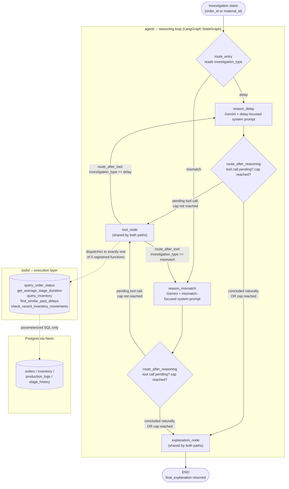

# Architecture

How a request flows through the agent: entry → router → reasoning ↔ tool loop → explanation.
Both investigation paths (delay, mismatch) share every node except the reasoning node itself —
see [`agent/graph.py`](../agent/graph.py) for the code this diagram is drawn from, and the
[README](../README.md) for the non-technical version of this same story.

## Reading the diagram

- **The router runs once, before any reasoning happens.** `route_entry` is a *conditional
  entry point* — it looks at `investigation_type` (set when the initial state was built, not
  decided by the LLM) and sends the run into `reason_delay` or `reason_mismatch`. Everything
  downstream of that first decision is identical machinery for both paths.
- **The loop is the two reasoning nodes plus `tool_node`.** Each reasoning node calls Gemini
  with the current evidence; if Gemini asks for a tool, `route_after_reasoning` sends control
  to `tool_node`, which runs it and loops back — via `route_after_tool` — to *the same*
  reasoning node the investigation started at. This repeats until Gemini concludes on its own
  or the tool-call cap is hit; either way, `route_after_reasoning` sends control to
  `explanation_node` instead.
- **`tool_node` and `explanation_node` are not duplicated per path.** Both reasoning nodes
  route into the same two node instances — the only thing that differs between the delay and
  mismatch paths is which system prompt frames the investigation.
- **The agent layer never touches SQL directly.** `tool_node` calls into `tools/`, and only
  `tools/` talks to Postgres — every query there is parameterized (no string-built SQL), and
  every tool function validates its inputs and raises a single shared `ToolQueryError` on
  failure rather than leaking a raw database error back into the agent's reasoning.
